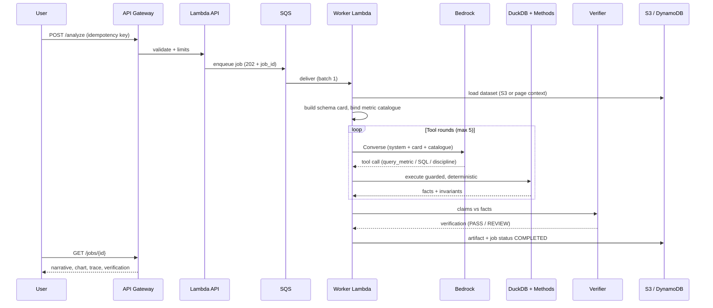

# OmniAnalyst — Request Lifecycle (Mermaid)

```mermaid
sequenceDiagram
    participant U as User
    participant G as API Gateway
    participant L as Lambda API
    participant Q as SQS
    participant W as Worker Lambda
    participant B as Bedrock
    participant E as DuckDB + Methods
    participant V as Verifier
    participant S as S3 / DynamoDB

    U->>G: POST /analyze (idempotency key)
    G->>L: validate + limits
    L->>Q: enqueue job (202 + job_id)
    Q->>W: deliver (batch 1)
    W->>S: load dataset (S3 or page context)
    W->>W: build schema card, bind metric catalogue
    loop Tool rounds (max 5)
        W->>B: Converse (system + card + catalogue)
        B-->>W: tool call (query_metric / SQL / discipline)
        W->>E: execute guarded, deterministic
        E-->>W: facts + invariants
    end
    W->>V: claims vs facts
    V-->>W: verification (PASS / REVIEW)
    W->>S: artifact + job status COMPLETED
    U->>G: GET /jobs/{id}
    G-->>U: narrative, chart, trace, verification
```
