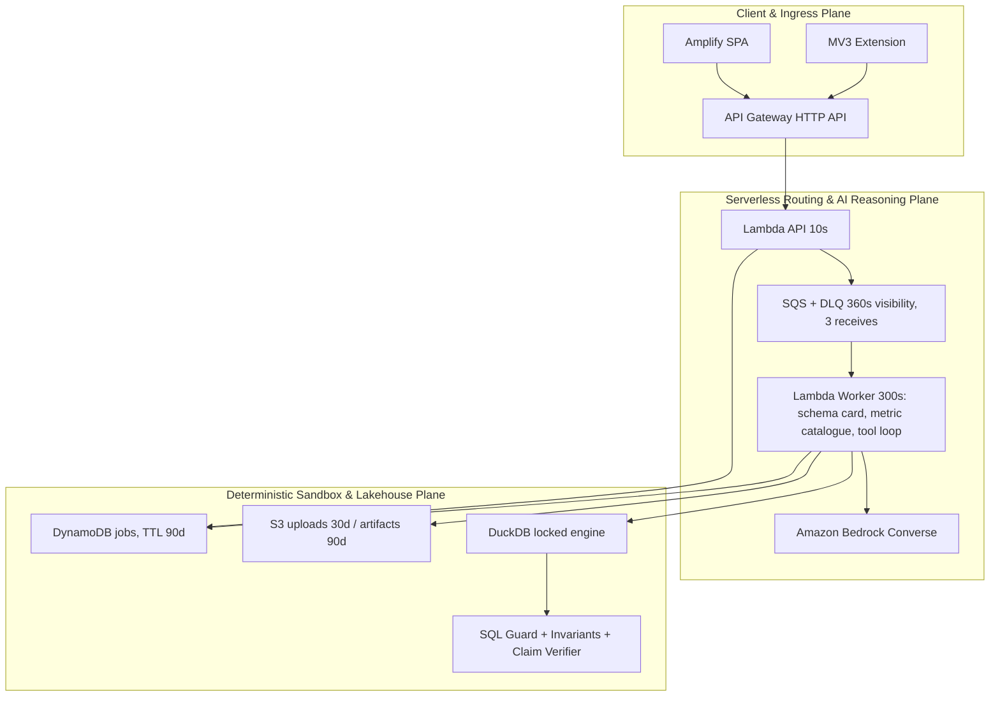

# OmniAnalyst — AWS Infrastructure (Mermaid)

```mermaid
flowchart TB
    subgraph CLIENT[Client & Ingress Plane]
        SPA[Amplify SPA]
        EXT[MV3 Extension]
        APIGW[API Gateway HTTP API]
    end
    subgraph ROUTING[Serverless Routing & AI Reasoning Plane]
        API[Lambda API 10s]
        SQSQ[SQS + DLQ 360s visibility, 3 receives]
        WRK[Lambda Worker 300s: schema card, metric catalogue, tool loop]
        BRK[Amazon Bedrock Converse]
    end
    subgraph SANDBOX[Deterministic Sandbox & Lakehouse Plane]
        DDB[DuckDB locked engine]
        GRD[SQL Guard + Invariants + Claim Verifier]
        S3[S3 uploads 30d / artifacts 90d]
        DYN[DynamoDB jobs, TTL 90d]
    end
    SPA --> APIGW
    EXT --> APIGW
    APIGW --> API --> SQSQ --> WRK
    WRK --> BRK
    WRK --> DDB --> GRD
    WRK --> S3
    WRK --> DYN
    API --> DYN
```
