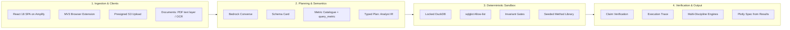

# OmniAnalyst — Architecture Overview (Mermaid)

```mermaid
flowchart LR
    subgraph A[1. Ingestion & Clients]
        A1[React 18 SPA on Amplify]
        A2[MV3 Browser Extension]
        A3[Presigned S3 Upload]
        A4[Documents: PDF text layer / OCR]
    end
    subgraph B[2. Planning & Semantics]
        B1[Bedrock Converse]
        B2[Schema Card]
        B3[Metric Catalogue + query_metric]
        B4[Typed Plan: Analyst IR]
    end
    subgraph C[3. Deterministic Sandbox]
        C1[Locked DuckDB]
        C2[sqlglot Allow-list]
        C3[Invariant Gates]
        C4[Seeded Method Library]
    end
    subgraph D[4. Verification & Output]
        D1[Claim Verification]
        D2[Execution Trace]
        D3[Multi-Discipline Engines]
        D4[Plotly Spec from Results]
    end
    A --> B --> C --> D
```
